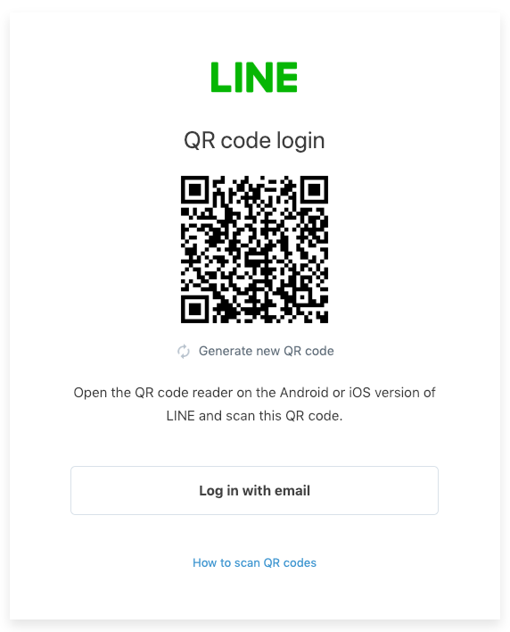
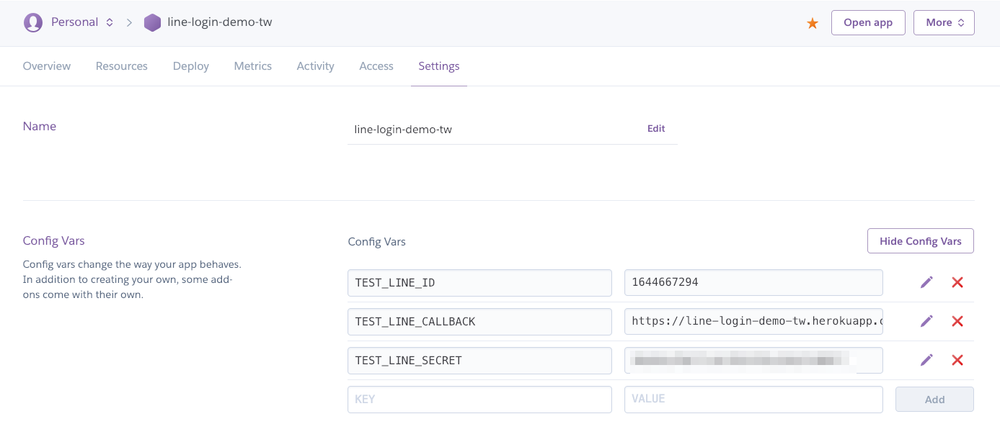

# line-login



Trying LINE Login on a web app using [golang](https://golang.org). See [demo site](https://line-login-demo-tw.herokuapp.com/).

### Heroku

Click on the Heroku button to easily deploy your app:

[](https://heroku.com/deploy)

Or alternatively you can follow the manual steps:

Clone this repository:

```
$ git clone https://github.com/go-training/line-login.git
```

Set the buildpack for your application

```
$ heroku config:add BUILDPACK_URL=https://github.com/go-training/line-login.git
```

Add Heroku git remote:

```
$ heroku git:remote -a your-application
```

Deploy it!

```
$ git push heroku master
```

Line config in heroku dashboard:


